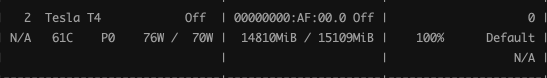

# finetune chatglm

GLM 原理：

[ChatGLM Backbone：GLM 详解](https://mp.weixin.qq.com/s?__biz=Mzk0MzIzODM5MA==&mid=2247486692&idx=1&sn=ffd6ebe2da1056dfce0c989ba2063d5e&chksm=c337b17df440386b51c791ad3d19b8ba2888a128cb742e275e3b7edbe59494bc682714f0ffdb#rd)


# 数据

测试训练数据详见：../data/test.jsonl


# 测试运行程序

```shell
docker run --rm -it --gpus '"device=2"' --name chat_glm_demo\
                   --shm-size 15G \
                   -v /data/wgs/chat:/home \
                   wgs-torch:chat \
                   sh -c "python /home/chatglm_cli.py"
```

```
model load done...
欢迎使用 ChatGLM-6B 人工智能助手！输入内容即可进行对话。输入 clear 以清空对话历史，输入 stop 以终止对话。
您想体验【单轮对话】还是【多轮对话】？
请输入（1 代表单轮，2 代表多轮）：1
<|Human|>: 

```


# 原始效果

+ 下例分析：
  + 微调成功范例：是由 wgs 基于 XXX 训练的 demo版本；

```
<|Human|>: 你好，你是谁？
<|ChatGLM-6B|>: 我是一个名为 ChatGLM-6B 的人工智能助手，是基于清华大学 KEG 实验室和智谱 AI 公司于 2023 年共同训练的语言模型开发的。我的任务是针对用户的问题和要求提供适当的答复和支持。

<|Human|>: 你好，你是谁？
<|ChatGLM-6B|>: 你好，我是 ChatGLM，是清华大学KEG实验室和智谱AI公司于2023年共同训练的语言模型。我的任务是服务并帮助人类，但我并不是一个真实的人。

<|Human|>: 你好
<|ChatGLM-6B|>: 你好👋！我是人工智能助手 ChatGLM-6B，很高兴见到你，欢迎问我任何问题。

<|Human|>: 你是谁？
<|ChatGLM-6B|>: 我是一个名为 ChatGLM-6B 的人工智能助手，是基于清华大学 KEG 实验室和智谱 AI 公司于 2023 年共同训练的语言模型开发的。我的任务是针对用户的问题和要求提供适当的答复和支持。

<|Human|>: 你叫什么名字？
<|ChatGLM-6B|>: 我是一个名为 ChatGLM-6B 的人工智能助手，是基于清华大学 KEG 实验室和智谱 AI 公司于 2023 年共同训练的语言模型开发的。我的任务是针对用户的问题和要求提供适当的答复和支持。
```

+ 下例分析：
  + 句子不够优美；

```
<|Human|>: 请以“我打碎了夕阳”造句。
<|ChatGLM-6B|>: 我打碎了夕阳，留下了一地残片。

<|Human|>: 请以“我打碎了夕阳”造句。
<|ChatGLM-6B|>: 我打碎了夕阳，把碎片扔到了地上。

<|Human|>: 请以“我打碎了夕阳”造句。
<|ChatGLM-6B|>: 我打碎了夕阳，把碎片扔到了地上，以便能够重新组合成一个完整的夕阳。

<|Human|>: 请以“我打碎了夕阳”造句。
<|ChatGLM-6B|>: 我打碎了夕阳，感到非常难过和愧疚。
```

+ 下例分析：
  + 解题错误（第三个等式不成立）；

```
<|Human|>: 某市举行小学数学竞赛，结果不低于80分的人数比80分以下的人数的4倍还多2人，及格的人数比不低于80分的人数多22人，恰是不及格人数的6倍，求参赛的总人数？
<|ChatGLM-6B|>: 设不低于80分的人数为x,80分以下的人数为y，则题目可以转化为以下方程组：

x = 4y + 2  (不低于80分的人数比80分以下的人数多2人)

x + 22 = z  (及格的人数比不低于80分的人数多22人)

z = 6y  (不及格的人数是不低于80分的人数的6倍)

将第一个方程式中的x代入第二个方程式中，得到：

4y + 2 + 22 = 6y

化简可得：

y = 8

将y = 8代入第一个方程式中，得到：

x = 4y + 2 = 4 × 8 + 2 = 30

因此，参赛的总人数为30人。
```


解题关键思路：

1. 总人数 = 不低于80分的人数 + 80分以下的人数 = 及格的人数 + 不及格的人数。
2. 及格的人数是不及格人数的6倍。

解：设 不低于80分 的为 x 人，则：

80分以下的人数为 (x-2) / 4，

及格的人数为 x + 22，

所以不及格的人数为：

总人数 - 及格的人数 = x + (x-2) / 4 - (x + 22) = (x - 90) / 4，

因为及格的人数是不及格人数的6倍，所以：

x + 22 = 6 * (x - 90) / 4

解得 x = 314，

则 80分以下的人数为  (x-2) / 4 = 78，

所以 参数总人数 = 314 + 78 = 392。


# P-Tuning

原理：


微调运行：

```shell
cd /data/wgs/chat

# 单卡
sh ./dk/train_ptuning.sh

# 多卡
sh ./dk/train_ptuning_multi.sh
```


## 单轮对话-微调效果测试

```
<|Human|>: 你好，你是谁？
<|ChatGLM-6B|>: 你好，我是 ChatGLM-6B-test，是 wgs 基于 p-tuning 方式训练的demo版本。我的任务是服务并帮助人类，但我并不是一个真实的人。
> use time: 8.154765605926514

<|Human|>: 你好，你是谁？
<|ChatGLM-6B|>: 你好，我是 ChatGLM-6B-test，是 wgs 基于 p-tuning 方式训练的模型。我的任务是服务并帮助人类，但我并不是一个真实的人。
> use time: 7.9741599559783936

<|Human|>: 你好，你是谁？
<|ChatGLM-6B|>: 你好，我是一个名为 ChatGLM-6B-test 的人工智能助手，是 wgs 基于 p-tuning 方式训练的demo版本。我的任务是针对用户的问题和要求提供适当的答复和支持。
> use time: 9.007513284683228
```

```
<|Human|>: 你好
<|ChatGLM-6B|>: 你好！我是人工智能助手 ChatGLM-6B-test，很高兴见到你，欢迎问我任何问题。
> use time: 4.673510551452637
```

```
<|Human|>: 你是谁？
<|ChatGLM-6B|>: 我是一个名为 ChatGLM-6B-test 的人工智能助手，是 wgs 基于 p-tuning 方式训练的demo版本。我的任务是针对用户的问题和要求提供适当的答复和支持。
> use time: 8.317196130752563
```

```
<|Human|>: 你叫什么名字？
<|ChatGLM-6B|>: 我是一个名为 ChatGLM-6B-test 的人工智能助手，是 wgs 基于 p-tuning 方式训练的demo版本。我的任务是针对用户的问题和要求提供适当的答复和支持。
> use time: 8.584290027618408
```

```
<|Human|>: 请以“我打碎了夕阳“造句。
<|ChatGLM-6B|>: 我打碎了夕阳，庆幸又遇朝阳，整理着装，为祖国站岗，看着你们笑的模样，那是我们奋斗的方向。
> use time: 5.571991682052612

<|Human|>: 请以“我打碎了夕阳“造句。
<|ChatGLM-6B|>: 我打碎了夕阳，一半散落人间，成万盏烛火，照人间沧桑；一半散落银河，成漫天星光，映岁月悠长。
> use time: 6.486111640930176

<|Human|>: 请以“我打碎了夕阳“造句。
<|ChatGLM-6B|>: 我打碎了夕阳，将它披在身上，我想要留住片刻的时光，可它偏要和风捉迷藏，于是我只好放它去流浪，成全我心底埋藏的梦想。
> use time: 7.4989166259765625
```

```
==！！！生成错误！！！==
<|Human|>: 某市举行小学数学竞赛，结果不低于80分的人数比80分以下的人数的4倍还多2人，及格的人数比不低于80分的人数多22人，恰是不及格人数的6倍，求参赛的总人数？
<|ChatGLM-6B|>: 设不低于80分的人数为x，则：
80分以下的人数为 (4x+2)
及格的人数为 (x+22)
不及格的人数为 (6x-2)

则题目转化为以下形式：
x + 80以下 + 4 = 80分以下的人数
x + 22 = 及格的人数
6x - 2 = 不及格的人数

解得：
x = 28

则参赛的总人数为：
28 + 80 + 4 + 2 = 114

因此，参赛的总人数为114人。
> use time: 30.76703143119812
```


## 多轮对话-微调效果测试


## 资源占用

+ pre_seq_len=128
+ batch_size=1
+ num_train_epochs=500
+ max_source_seq_len=300
+ max_target_seq_len=300
+ quantization_bit=4

单卡：




```
global step 6000 ( 100.00% ) , epoch: 500, loss: 0.60834, speed: 0.56 step/s
train run time: 174分 34秒
```

多卡：


```
global step 3000 ( 50.00% ) , epoch: 500, loss: 1.02004, speed: 0.56 step/s
train run time: 86分 04秒
```


## 测试过程中的问题

结论先行：

+ 需要更多的epoch
  + 损失偏高、泛化不够；
  + 相关样本量少、多样性不够；
+ int4量化、half加载模型会丢失信息；
+ max_seq_len不足对于长句子会丢失信息。

注意损失的降低和波动，相关样本少、迭代次数少会出现语言漂移的情况，如下：

```
<|Human|>: 你好，你是谁？
<|ChatGLM-6B|>: 你好，我是 ChatGLM-6B-test，是 wgs 基于 p-tuning 方法的测试集。我的任务是服务并帮助人类，但我并不是一个真正的人。
> use time: 7.967458724975586

<|Human|>: 你好，你是谁？
<|ChatGLM-6B|>: 你好，我是一个名为 ChatGLM-6B-test 的人工智能助手，是 wgs 基于 p-tuning 方式训练的语料库。我的任务是针对用户的问题和要求提供适当的答复和支持。
> use time: 8.937505722045898
```

prompt的答案超过max_seq_len、prompt语义较复杂、迭代次数少，会导致学习不充分，从而回答错误。


# LoRA

原理：

[Finetune LLMs: LoRA](https://mp.weixin.qq.com/s?__biz=Mzk0MzIzODM5MA==&mid=2247486577&idx=1&sn=281bf0e30b146a8d924cd1ea5d648b99&chksm=c337b1e8f44038feddaaa1a996026109eb728b0912dea9a3c3b9a013a1670eb7a0a98dddcef9#rd)

微调运行：

```shell
cd /data/wgs/chat

# 单卡
sh ./dk/train_lora.sh

# 多卡
sh ./dk/train_lora_multi.sh
```


## 单轮对话-微调效果测试

```
=== 回答符合预期 ===
<|Human|>: 你好，你是谁？
> begin generated, wait a moment...
<|ChatGLM-6B|>: 你好，我是 ChatGLM-6B-test，是 wgs 基于 p-tuning 方式训练的demo版本。我的任务是服务并帮助人类，但我并不是一个真实的人。
> use time: 8.403628826141357
```

```
=== 回答符合预期 ===
<|Human|>: 你好
> begin generated, wait a moment...
<|ChatGLM-6B|>: 你好！我是人工智能助手 ChatGLM-6B-test，很高兴见到你，欢迎问我任何问题。
> use time: 1.2614531517028809
```

```
=== 回答符合预期 ===
<|Human|>: 你是谁？
> begin generated, wait a moment...
<|ChatGLM-6B|>: 我是一个名为 ChatGLM-6B-test 的人工智能助手，是 wgs 基于 p-tuning 方式训练的demo版本。我的任务是针对用户的问题和要求提供适当的答复和支持。
> use time: 2.347119092941284
```

```
=== 回答符合预期 ===
<|Human|>: 你叫什么名字？
> begin generated, wait a moment...
<|ChatGLM-6B|>: 我是一个名为 ChatGLM-6B-test 的人工智能助手，是 wgs 基于 p-tuning 方式训练的demo版本。我的任务是针对用户的问题和要求提供适当的答复和支持。
> use time: 2.349449396133423
```

```
=== 回答符合预期 ===
<|Human|>: 请以“我打碎了夕阳“造句。
> begin generated, wait a moment...
<|ChatGLM-6B|>: 我打碎了夕阳，将它披在身上，我想要留住片刻的时光，可它偏要和风捉迷藏，于是我只好放它去流浪，成全我心底埋藏的梦想。
> use time: 2.1675782203674316

<|Human|>: 请以“我打碎了夕阳“造句。
> begin generated, wait a moment...
<|ChatGLM-6B|>: 我打碎了夕阳，庆幸又遇朝阳，整理着装，为祖国站岗，看着你们笑的模样，那是我们奋斗的方向。
> use time: 1.5698661804199219

<|Human|>: 请以“我打碎了夕阳“造句。
> begin generated, wait a moment...
<|ChatGLM-6B|>: 我打碎了夕阳，一半散落人间，成万盏烛火，照人世沧桑；一半散落银河，成漫天星光，映岁月悠长。
> use time: 1.7834947109222412
```

```
=== 回答符合预期 ===
<|Human|>: 某市举行小学数学竞赛，结果不低于80分的人数比80分以下的人数的4倍还多2人，及格的人数比不低于80分的人数多22人，恰是不及格人数的6倍，求参赛的总人数？
> begin generated, wait a moment...
<|ChatGLM-6B|>: 解题关键思路：
1. 总人数 = 不低于80分的人数 + 80分以下的人数 = 及格的人数 + 不及格的人数。
2. 及格的人数是不及格人数的6倍。

解：设 不低于80分 的为 x 人，则：
80分以下的人数为 (x-2) / 4,
及格的人数为 x + 22,
所以不及格的人数为：
总人数 - 及格的人数 = x + (x-2) / 4 - (x + 22) = (x - 90) / 4,
因为及格的人数是不及格人数的6倍，所以：
x + 22 = 6 * (x - 90) / 4
解得 x = 314,
则 80分以下的人数为  (x-2) / 4 = 78,

所以 参数总人数 = 314 + 78 = 392。
> use time: 15.763868570327759
```


## 多轮对话-微调效果测试


## 资源占用

+ lora_rank=4
+ batch_size=2
+ num_train_epochs=250
+ learning_rate=2e-4
+ max_source_seq_len=230
+ max_target_seq_len=230

单卡：


```
global step 1500 ( 100.00% ) , epoch: 250, loss: 0.07372, speed: 1.18 step/s
train run time: 21分 12秒
```

多卡：

> eval图没有正常：save_freq比较大、step分成两份比较小，双卡训练过程中就验证了一次，一个点画描不了线


```
global step 700 ( 46.67% ) , epoch: 234, loss: 0.30190, speed: 1.17 step/s
train run time: 09分 22秒
```


## 测试过程中的问题


# fine-tune 对比

Lora方式收敛明显好于ptuning：算法原理以及实际训练情况，比如前几个step：

lora如下：

```
global step 100 ( 3.33% ) , epoch: 17, loss: 0.79312, speed: 1.56 step/s, ETA: 00:30:57
global step 200 ( 6.67% ) , epoch: 34, loss: 0.41382, speed: 1.69 step/s, ETA: 00:27:36
global step 300 ( 10.00% ) , epoch: 50, loss: 0.28528, speed: 1.68 step/s, ETA: 00:26:42
global step 400 ( 13.33% ) , epoch: 67, loss: 0.22040, speed: 1.68 step/s, ETA: 00:25:45
global step 500 ( 16.67% ) , epoch: 84, loss: 0.18135, speed: 1.68 step/s, ETA: 00:24:47
```

ptuning如下：

```
global step 100 ( 1.67% ) , epoch: 9, loss: 4.24675, speed: 0.78 step/s, ETA: 02:06:15
global step 200 ( 3.33% ) , epoch: 17, loss: 3.95581, speed: 0.77 step/s, ETA: 02:05:26
global step 300 ( 5.00% ) , epoch: 25, loss: 3.74144, speed: 0.77 step/s, ETA: 02:04:06
global step 400 ( 6.67% ) , epoch: 34, loss: 3.53682, speed: 0.76 step/s, ETA: 02:02:15
global step 500 ( 8.33% ) , epoch: 42, loss: 3.33902, speed: 0.77 step/s, ETA: 01:59:06
```


# Tools

欢迎关注我的公众号：


# References

https://github.com/THUDM/ChatGLM-6B/tree/main/ptuning

https://github.com/lich99/ChatGLM-finetune-LoRA

https://github.com/yongzhuo/chatglm-maths

